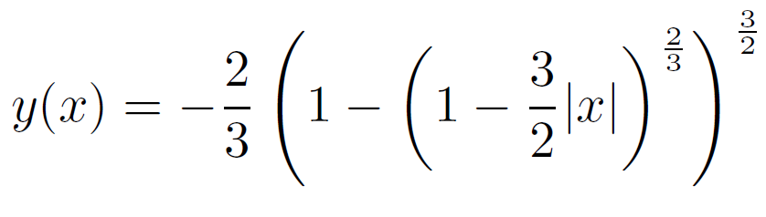
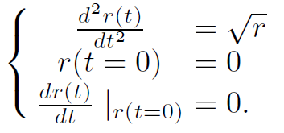
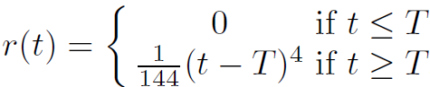
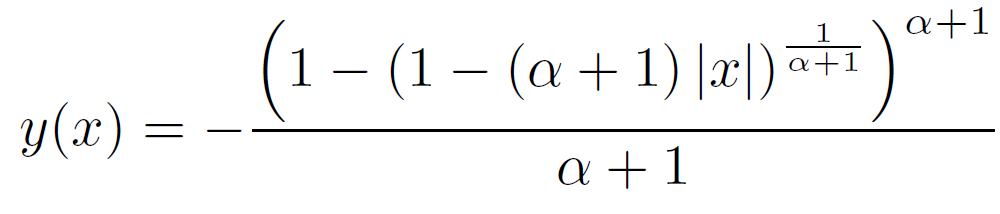
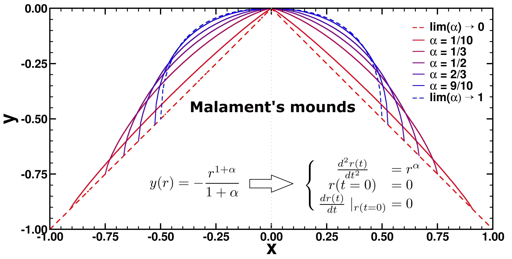

# NortonDomeExplorer
Classical Newtonian mechanics is generally considered a prime example of 
determinism. It is however possible to construct systems within the 
confines of Newtonian mechanics which appear indeterministic.
The NortonDomeExplorer was developed for the exploration of such an 
example:[\[1\]](#ref_DS1) the dynamics of a point-mass on Malament-mounds[\[2\]](#ref_mal),
more specifically the case of the Norton Dome[\[3\]](#ref_nort).

## Background: Norton Domes and Malament-mounds
In 2003, the philosopher of science John D. Norton presented a thought experiment which
exhibits non-deterministic behaviour within the context of Newtonian mechanics. The setup 
is quite simple. Imagine a hill (or mound) with a shape such that a point mass located 
on the apex (where it has a zero velocity) may roll downward following the hill's curvature 
exactly due to the downward gravitational pull. The shape of the hill is given by the 
equation:

The dynamical problem can also be expressed in terms of the arclength **r(t)**

This appears as an innocent example of an unstable equilibrium situation, however,
this shape is chosen such that the initial value problem is not 
[Lipschitz-continuous](https://en.wikipedia.org/wiki/Lipschitz_continuity). The mass will 
stay on the apex forever, or it will start rolling of after any possible delay
time T.  

Although the latter solutions could be considered as the result of small perturbations,
this is not the case in this thought experiment. Here, the movement is initiated without
perturbation giving rise to non-deterministic behaviour in a system which could come straight 
from a textbook on Newtonian physics. 
The Norton Dome problem can be generalized to entire family of surfaces of the shape:
 
and which look like

.

## Conciliating physical intuition and the Norton Dome 
The non-deterministic behaviour presented by the Norton Dome (and which extends to all members
of the Malament Mounds) goes against the physical intuition of 
most physicists. To find the source of this apparent contradiction, we set out to assign 
a probability to the different solutions of this dynamic problem.[\[1\]](#ref_DS1) 
Although Norton's dome received much attention by philosophers of science, as simple
example of indeterminism in Newtonian mechanics, none have looked into assigning 
probabilities to the different solutions. This may originate from the observation
that standard probability distributions can not be used for this problem.
<!-- ?? Sylvia ?? ik heb hier vage herinneringen aan wat je daarover vertelde 
maar onvoldoende om dat juist te formuleren. één aspect dat ik me er van 
herinner is dat je geen infinitesimale kansen mag/kan toekennen?
-->
Analysing the problem using hyper-real numbers, we find that the solutions with infinitesimally 
small delays T (*i.e.*, real part of T=0) give rise to non-zero real probabilities. In contrast,
solutions with a non-infinitesimal delay appear to have an infinitesimal probability.
 
Our approach starts from a discretization of time in infinitessimal steps. Something
which most physicists are familiar with, but in this case it is rooted in the 
mathematical rigorous formalism of non-standard analysis.[\[4\]](#ref_NonSA)
Making use of the transfer principle of non-standard analysis, we associate 
infinitesimal initial conditions with real-valued ones which allows us to 
assign probabilities to the latter by measuring them on the former on the phase space. 

Dynamics of the Norton Dome system on the phase space of initial conditions.

## Usage:
### Installation
The program can be either downloaded as [64bit windows binary](bin/) or compiled 
from [source](source/) using a [Delphi-compiler](https://www.embarcadero.com/products/delphi). 

### Running the program
1. Start the program
2. In the *Screen* section select:
    * the initial conditions: (R0,R1) or (R0,V0)
    * and set the ranges as Point 1 (R0) and Point 2 (R1 or V0)
    * the alpha-power of the general Malament-mound formalism 
	   (Norton Dome: alpha=0.5)
    * the time-step DeltaT
    * the number of iterations
3. In the *Run Options* section:
	1. press *Run Simulation* (a progressbar shows the progress of the simulation)
    2. press *Draw T* to visualise the delay times for all initial conditions 	

## References
**<a name="ref_DS1">\[1\]</a>** *"Assigning probabilities to non-Lipschitz mechanical systems"*, D. E. P. Vanpoucke and S. Wenmackers, *European Physical Journal* **X**, YY-YY (2020) [ArXiv](https://arxiv.org/abs/2001.10375) 
**<a name="ref_mal">\[2\]</a>** *"Norton's slippery slope"*, D. B. Malament, *Philosophy of Science* **75**, 799-816 (2008) 
**<a name="ref_nort">\[3\]</a>** *"Causation as folk science"*, J. D. Norton, *Philosophers' Imprint* **3** (2003) and
*"The dome: An unexpectedly simple failure of determinism"*, J. D. Norton, *Philosophy of Science* **75**, 786-798 (2008) 
**<a name="ref_nonSA">\[4\]</a>** *"Title"*, Author, *Journal* **Volume**, Pages (Year)  

