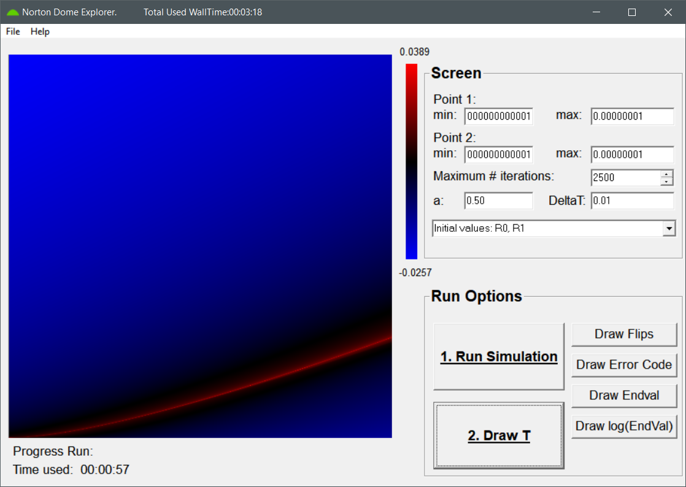

#  NortonDomeExplorer
Classical Newtonian mechanics is generally considered a prime example of a deterministic theory.
It is however possible to construct systems within the confines of Newtonian mechanics which appear to be indeterministic.
The NortonDomeExplorer was developed for the exploration of the discretized version of such an example
[\[1\]](docs/3_ReferenceList.md#ref_DS1): the dynamics of a point mass on Malament's mounds[\[2\]](docs/3_ReferenceList.md#ref_mal), 
including the special case of Norton's dome[\[3\]](docs/3_ReferenceList.md#ref_nort).

The Norton Dome Explorer GUI.

 

### Table of content

1. [Norton's dome & Malament's mounds](docs/1_Background.md#background) 
    1.1. [Introduction](docs/1_Background.md#background_Intro)  
    1.2. [Assigning probabilities](docs/1_Background.md#background_Prob) 
    1.3. [Phase space vector field](docs/1_Background.md#background_Phase) 
2. [Usage](docs/2_Manual.md) 
    2.1. [Installation](docs/2_Manual.md#Install) 
    2.2. [Users manual](docs/2_Manual.md#ManualND) 
3. [References](docs/3_ReferenceList.md) 

### Citations
If you use the NortonDomeExplorer in your research, we would appreciate a citation to the corresponding publication:
 - *"Assigning probabilities to non-Lipschitz mechanical systems"*, D. E. P. Vanpoucke and S. Wenmackers, *Chaos* **31**, 123131 (2021) [Chaos](https://doi.org/10.1063/5.0063388) / [ArXiv](https://arxiv.org/abs/2001.10375) 

