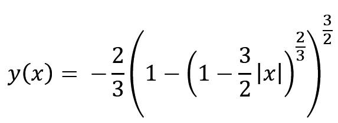
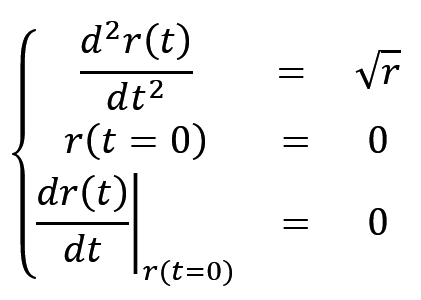
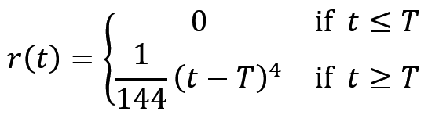
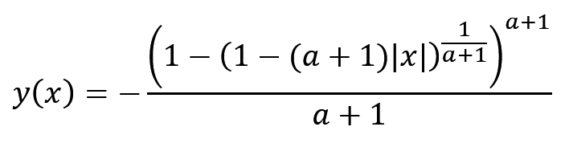
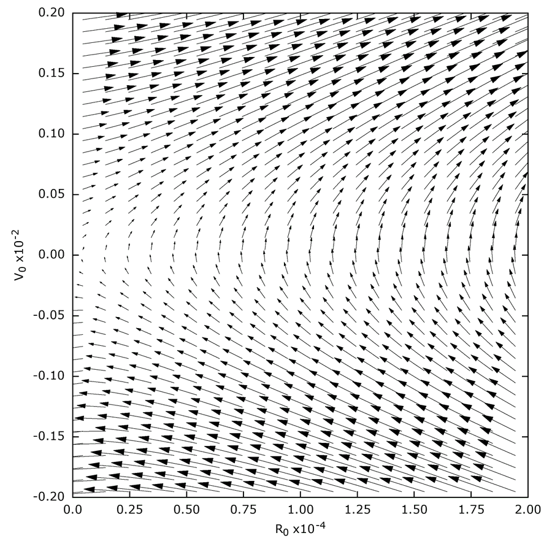
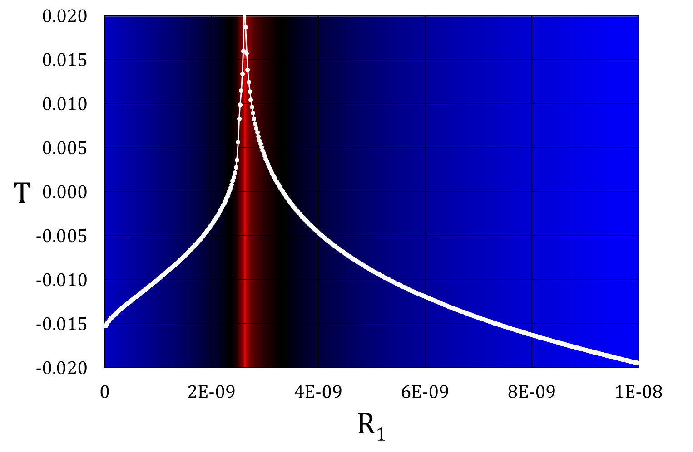

[Back to main page](../README.md)

1. [Norton's dome & Malament's Mounds](#background) 
    1.1. [Introduction](#background_Intro) 
    1.2. [Assigning probabilities](#background_Prob) 
    1.3. [Phase Space vector field](#background_Phase) 

#  1. Norton's dome and Malament's mounds  

    
[Top](#Top) 

##   1.1. Introduction
In 2003, the philosopher of science John D. Norton presented a thought experiment which exhibits non-deterministic behaviour 
within the context of Newtonian mechanics. The setup is quite simple. Imagine a hill (or mound) with a shape such that a point 
mass located on the apex (where it has a zero velocity) may roll downward following the hill's curvature exactly due to the 
downward gravitational pull. The shape of the hill is given by the equation:

The dynamical problem can also be expressed in terms of the arc length **r(t)**

This appears to be an innocent example of an unstable equilibrium situation, however, the dome's shape is chosen such that 
the initial value problem is not [Lipschitz-continuous](https://en.wikipedia.org/wiki/Lipschitz_continuity). As a result, 
there is a continuum of solutions: the mass may stay at the apex forever, or it may start rolling of after any possible 
delay time T.  

Although the latter solutions could be considered as the result of small perturbations, just as in the case of deterministic 
systems with an unstable equilibrium, no perturbation is required in this thought experiment. Here, the movement is initiated 
spontaneously, without any perturbation, giving rise to non-deterministic behaviour in a system that looks like it could come straight 
from a textbook on Newtonian physics. 
Norton's dome problem can be generalized to an entire family of surfaces of the shape:

and which look like

Cross-section of Malament's mounds for various values of the power <b>a</b>. The two limiting cases are 
indicated by the dashed lines.

##  1.2. Assigning probabilities to the Norton's dome and Malament's mounds solutions
Initial value problems in Newtonian physics that are indeterministic due to non-Lipschitz continuity do not even come with a probability distribution.
We set out to find a natural procedure for assigning probabilities to their solutions[\[1\]](#ref_DS1).
Since Norton's dome received much attention by philosophers of science, as a simple example of indeterminism in Newtonian mechanics, we have used this toy example and Malament's generalization to develop a method for assigning probabilities to the different solutions. 

Our approach starts from a discretization of time, which results in difference equations instead of differential equations.
This approach is familiar to most physicists, but we have formalized the idea of infinitesimal time steps and perturbations with a recent mathematical formalism: Alpha-theory[\[4\]](#ref_NonSA).
Before considering the Alpha-limit, we had to study the difference equations with non-infinitesimal time steps and perturbations.
Since there is no known solution for the discrete version of Norton's dome and Malament's mounds, an important component of our study consisted of numerical results.
This prompted us to develop this program. Some results can be seen in [\[1\]](#ref_DS1).

Our assignment of probabilities to solutions of the differential equation works is based on a measure of the phase space of solutions 
to the difference equations in the Alpha-limit. (This is possible because the map from the latter to the former is many-to-one.)

Dynamics of the discretized version of Norton's dome system on the phase space of initial conditions.

 

We found that the relation of the delay time T as function of the (infinitesimal) initial conditions is highly non-linear, with the positive 
(red) delay times being very localised.

Dependence of T on R1 at a constant value of R0.

 

As a result of this, we found that regular solutions with any observable delay time have zero probability.
The regular solution with T=0, which describes that the mass slides off without any observable delay, has unit probability.
(The trivial solution of the mass remaining at the apex forever has zero probability as well.)
 
 

##  1.3. Phase space vector field for all Malament's mounds

 

Numerical results for the vectorfield on the phase-space for varying power
<b>a</b> of the Malament Mounds. Generated using the PhaseSpace program and gnuplot animation script ([source](../source/PhaseSpace)/[binary](../bin/).

 
